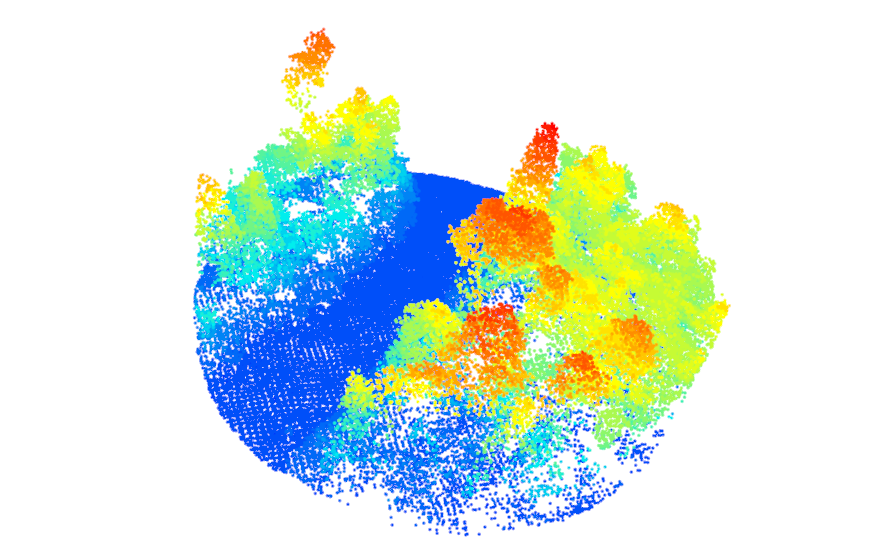
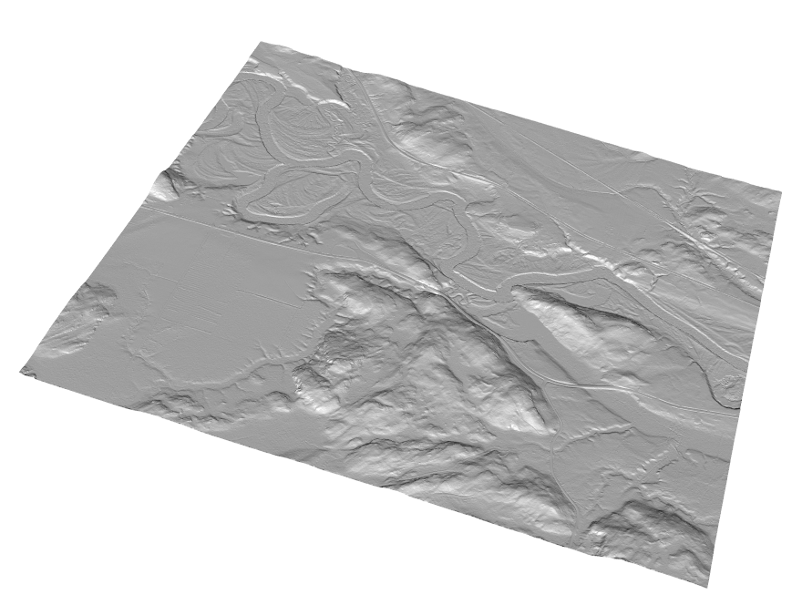

```{r,echo=FALSE,message=FALSE,warning=FALSE}
library(lidR)
library(ggplot2)
library(sf)

r3dDefaults = rgl::r3dDefaults
m = structure(c(0.921, -0.146, 0.362, 0, 0.386, 0.482, -0.787, 0, 
-0.06, 0.864, 0.5, 0, 0, 0, 0, 1), .Dim = c(4L, 4L))
r3dDefaults$FOV = 50
r3dDefaults$userMatrix = m
r3dDefaults$zoom = 0.75

knitr::opts_chunk$set(
  comment =  "#>", 
  collapse = TRUE,
  fig.align = "center")

rgl::setupKnitr(autoprint = TRUE)

#Data
roads <- st_read("data/03/roads.shp")
```

# Reading, Generating, and Plotting Input Data {#sec-reading-generating-and-plotting-input-data}

## Reading LiDAR data {#sec-reading-lidar-data}

The `lidR` function `readLAS()` reads a LAS or LAZ file and returns an object of class `LAS`. Detailed information on loading LiDAR data using the `lidR` package can be found in the [dedicated `lidR` vignette](https://cran.r-project.org/web/packages/lidR/vignettes/lidR-LAS-class.html). In this user guide, we do not delve deeply into methods for working with ALS data and instead refer interested users to the [lidR book](https://r-lidar.github.io/lidRbook/io.html#read).



## Reading LiDAR data using `readLAScatalog` {#sec-reading-lidar-data-using-readlascatalog}

A `LAScatalog` is a representation in R of a LAS file or a collection of LAS files. In `lidR`, the function `readLAScatalog()` creates an object that represents, in R, a collection of LAS files not loaded in memory.

``` r
ctg <- readLAScatalog("path/to/ctg/files")
```

The `print()` function can summarize information about the `LAScatalog`, such as the number and density of points.

``` r
print(ctg)
```

## Reading and Generating DTM Raster Data {#sec-reading-and-generating-dtm-raster-data}

### Reading a raster DTM using `raster` {#sec-reading-raster-dtm-data-using-raster}

`ALSroads` users may be provided with a 1 m resolution DTM that covers the `LAScatalog` coverage (refer to section \@ref(sec-dtm-data) for DTM requirements). If a 1 m DTM is provided, users can load this information using the `raster` package.

``` r
library(raster)
dtm <- raster("path/to/dtm.tif)
```

The loaded DTM can be plotted for visualization using the `plot_dtm3d()` function from the `lidR` package.

``` r
plot_dtm3d(dtm, bg = "white")
```



### Generating DTM data using `rasterize_terrain()` {#sec-generating-dtm-data-using-grid_terrain}

`ALSroads` users that do not have an existing 1 m resolution DTM can produce a DTM using LAS data and the function `grid_terrain()` from the `lidR` packages.

The `rasterize_terrain()` function interpolates ground points and creates a DTM. Here we demonstrate the Triangular irregular network (tin) interpolation method. The TIN method is fast, efficient, and generates good DTMs. To generate a 1 m resolution DTM model with the TIN algorithm, we use the `rasterize_terrain()` function and (1) specify the algorithm using `algorithm = tin()`, and (2) specify the DTM resolution using `res = 1`.

``` r
dtm_tin <- rasterize_terrain(ctg, res = 1, algorithm = tin())
```

## Reading Vector Road Data using `st_read()` {#sec-reading-vector-road-data-using-st_read}

An existing road network is required to perform road extraction using `ALSroads`. Once users have sourced road data (file format = shapefile), the entire road network can be loaded into R using the `sf` package. The function `st_read()` reads simple features from a file. Detailed information on the `st_read()` function and the `sf` package is available online in a [dedicated vignette](https://r-spatial.github.io/sf/articles/).

``` r
roads <- st_read("path/to/roads")
```

```{r, message=FALSE, warning = FALSE, fig.align='center', fig.width=8, fig.height=6, echo = FALSE}
url = "https://servicesmatriciels.mern.gouv.qc.ca:443/erdas-iws/ogc/wmts/Inventaire_Ecoforestier/Inventaire_Ecoforestier/default/GoogleMapsCompatibleExt2:epsg:3/{z}/{y}/{x}.jpg"

m = mapview::mapview(roads,
  layer.name = "Road Segments",
  color = "red", map.type = "Esri.WorldImagery")
leaflet::addTiles(m@map, url)
```
