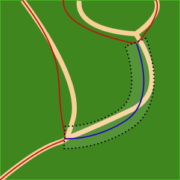

```{r,echo=FALSE,message=FALSE,warning=FALSE}
library(lidR)
library(raster)
library(sf)
library(ALSroads)

r3dDefaults = rgl::r3dDefaults
m = structure(c(0.921, -0.146, 0.362, 0, 0.386, 0.482, -0.787, 0, 
-0.06, 0.864, 0.5, 0, 0, 0, 0, 1), .Dim = c(4L, 4L))
r3dDefaults$FOV = 50
r3dDefaults$userMatrix = m
r3dDefaults$zoom = 0.75

knitr::opts_chunk$set(
  comment =  "#>", 
  collapse = TRUE,
  fig.align = "center")

rgl::setupKnitr(autoprint = TRUE)
```

# Standard Parameters {#sec-standard-parameters}

The `meaure_roads()` function is built with standard parameters. Users can change these parameters to suit the study areas for which road extraction is being completed. Most standard parameters are not expected to be changed and are suitable for road extraction across different areas. All the `measure_roads()` parameters are described below, but only the ones in **bold** should be considered by users.

If users need to customize the `measure_roads()` standard parameters, it is strongly recommended that they read the [method source paper](https://www.sciencedirect.com/science/article/pii/S1569843222002084#d1e1483).

## Extraction Parameters: {#sec-extraction-parameters}

Several of the `meaure_roads()` parameters are used to extract the point cloud, process it into small sections, and compute road profiles.

-   [road_max_len] Default = `2000 m`. The maximum size of a processed road section. If a road is longer than this value, it will be split into chunks of equal sizes (each less than the max road length value). The goal of this parameter is to reduce memory usage and computation time and avoid processing a long road without optimization.

-   **[road_buffer]** Default = `80 m`. The width of a buffer around the existing road for point cloud extraction. The algorithm processes only the point cloud within the buffer around the reference roads (see figure below). This value corresponds to the largeest road offset error (i.e., how incorrect the existing road track is) that can be fixed by the method. If the road buffer is 80 m, but a given road is 100 m off the real track, then the real road will be outside the extracted point cloud and won't be found. If the user knows that the road track error can be up to 100 m, then a road buffer value of 120 m is better suited than the 80 m default value. If the user knows that the maximum road track error is at most 30 m, then a buffer of 40 m will increase computation speed and reduce the chance of producing erroneous results.

    <center></center>

-   [road_max_width] Default = `30 m`. The maximum width of a road for metrics measurements. Editing the **road_buffer** distance supports the relocation of the road and minimizes computation time. Once the location of the road is determined, the road edges are generally +/- 10 m from the centerline. No matter the **road_buffer** distance used, once the proper road centerline is located, the **road_max_width** is set to 30 m to ensure that the method accurately classifies the road and road edges.

-   [section_length] Default = `10 m`. The length of sections of the road for metrics measurements. Roads are divided into sections, and for each section, the road width, road state, and other metrics are computed iteratively by processing slices perpendicular to the road. For example, using the default road section length (10 m), a 500m road will be split into 50 sections.

-   [profile_resolution] Default = `0.5 m`. The resolution of the profiles and DTMs for metrics measurements (see Figure 6 in the method [paper](https://www.sciencedirect.com/science/article/pii/S1569843222002084?via%3Dihub)).

## Embankment Parameters: {#sec-embankment-parameters}

The `meaure_roads()` function includes one parameter that specifies how the algorithm deals with embankments in the terrain.

-   [min_slope] Default = `10 degrees`. Slope (degrees) greater than the min_slope may initiate or terminate the detection of embankments. For example, if a slope of greater than 10 degrees is encountered on the right or the left of the road centerline, the method will consider this point the road edge. This is illustrated in the figure below. Nice slopes and ditches are expected to be detected to delimitate the road.

<center></center>

## Terrain Parameters (excluding embankment): {#sec-terrain-parameters}

The `meaure_roads()` function includes two parameters that specify how the algorithm detects road edges in the terrain aspect, excluding embankment/shoulder (see section \@ref(sec-embankment-parameters) for embankment parameters).

The purpose of these parameters is to allow the algorithm to find the edges of the road, even in the absence of embankments. Classifying the edges of roads using embankments is the preferable method. In the absence of clear embankments, defined by the road edge slopes, the method relies on the DTM complexity of each road section (see section \@ref(sec-extraction-parameters) for information on road sections) to classify the edges of the road. We refer to the classification of road edges using DTM complexity as the *"rescue method"* as it is used when the preferred method, based on road embankment, is not possible.

The assumptions that support the interpretation of DTM complexity to relocate roads is that roads are flat and not complex. If we remove potential slopes that follow the direction of the road, a road is roughly a 2D strip without variations in height (Z). The edges of a road correspond to the natural landscape and are more complex with a 3D structure and variations on the Z axis. On a given slice perpendicular to the road (see section \@ref(sec-extraction-parameters) for information on road slices), metrics on the ground points from left to right can be computed to assess the road profile. The road profile is expected to have higher values outside the boundaries of the road and lower or close to zero values inside the boundaries of the road. The road profile frequently resembles the shape of a parabola. Adjusting the method parameters determines the thresholds which define road edges, as illustrated in the figure below.

<center></center>

-   **[max_sd_ground_points]** Default = `0.1`. The LiDAR ground points belonging to roads have a low dispersion on Z profiles because roads are relatively flat (refer to Figure 6 in the method [paper](https://www.sciencedirect.com/science/article/pii/S1569843222002084?via%3Dihub)). Beyond the boundaries of a road, the standard deviation of ground points starts to increase because the terrain is more complex. This value is a threshold at which the edges of the roads are detected with the rescue method.

-   **[max_elevation_ground_points]** Default = `0.15`. The algorithm normalizes the point cloud relative to the road (i.e., the ground points from a road are expected to be at 0, and the surrounding points are expected to be non-zero). The rescue method uses this property to detect road edges.

The embankment method (section \@ref(sec-embankment-parameters)) and rescue method are not mutually exclusive. In many cases, an embankment may be detected on only one side of a road, meaning that the rescue method is used to detect the road edge on the other side. Changing terrain parameters is particularly important when the topography is flat. As the reader can see, a road can be detected, using both methods, based on geometrical features. However, when there is almost nothing to detect (i.e., no embankments and no DTM complexity), the algorithm fails and overestimates the road width. In this situation, decreasing the terrain parameter thresholds will lead to a narrowing of the detected road.

## Vegetation: {#sec-vegetation-parameters}

Once the width of the road is determined (see sections \@ref(sec-embankment-parameters) and \@ref(sec-terrain-parameters)), the method estimates the drivable road width using the parameter **max_percentage_drivable**. **max_percentage_drivable** is the total road width minus the vegetation that impedes road passage. The motivation for this parameter is that while the Slope and DTM can be used to locate a road on the landscape, that road may not be drivable due to vegetation growth. All the LiDAR points located on the road are expected to be ground points. To account for inaccuracies, we assume that 100% of the points on the road must be between 0 and 50 cm. If LiDAR points on the road are above 50 cm, there is vegetation on the road. A single point above 50 cm may be an outline, but a significant percentage of points above this value will trigger a stop signal. Starting from the centerline and going to the left and right, the method computes the cumulative percentage of non-ground points on the road. This produces a 'threshold-like' road profile for width measurement (see figure below).

<center></center>

-   **[max_percentage_drivable]** Default = `0.15`. The maximum percentage of LiDAR points above 50 cm (explained above).

## Conductivity Parameters: {#sec-conductivity-parameters}

A key component of the `measure_roads()` method is the development of a conductivity layer, where pixel values indicate the likelihood that a pixel is or is not drivable. Conductivity parameters correspond to the method used to estimate the overall conductivity layer using multiple sub-conductivity layers. Each layer is described in Figure 3 of the [method paper](https://www.sciencedirect.com/science/article/pii/S1569843222002084?via%3Dihub) and is activated using an activation function. These activation functions have two thresholds; unless otherwise stated. The values below correspond to these thresholds. It is **not** recommended for users to change the default values of these parameters.

-   **[sigma_min]** Default = `0.1`. The minimum conductivity layer value cannot be lower than this value. The conductivity layer construction is done such as conductivity values can range from 0 to 1. However, very low values (\<0.1) are problematic as they may form a gap in the road and result in a false negative (e.g., the gap may be interpreted as an impassible obstacle). Version 0.2.0 of the `ALSroads` package (not the one described in the [method paper](https://www.sciencedirect.com/science/article/pii/S1569843222002084?via%3Dihub), which is 0.1.0) introduced this parameter to allow the method to cross small gaps in the conductivity layer.

-   [s] Default = `c(5, 20)`. The slope (s) of the terrain indicates where a road cannot be. If the slope of the terrain is greater than the max slope, then a road cannot be present. To avoid binary logic and a hard threshold, a second threshold is introduced at 5° to transform the slope map into a sub-conductivity map using a piecewise-linear activation function. A slope of \< 5° has a conductivity of 1; between 5° and 20°, the conductivity decreases linearly to 0, making it impossible to move through pixels with steeper slopes.

-   [r] Default = `c(0.05, 0.1)`. The roughness (r) sub-conductivity layer is based on the assumption that a road surface is anticipated to be a smooth surface in a relatively rough environment.

-   [e] Default = `40`. This is a simple threshold activation function.

-   [q] Default = `c(0.1, 0.5)`. Intensity range (q) (difference between the maximum and the minimum) as an estimation of the intensity homogeneity. Rather than using the absolute thresholds, which are not applicable broadly with intensity, we use local and auto-adaptive thresholds based on two percentiles of intensity. Here the 10th and 50th percentiles of intensities are used as threshold values for the activation function.

-   [h] Default = `c(0.1, 0.2)`. The CHM can be interpreted to inform gaps in the canopy. Low CHM (h) values are interpreted to indicate the location of a drivable surface.

-   [d] Default = `c(0.25, 0.95)`. Ground point density values cannot be used directly because of their dependence on the local nominative sampling density. Consequently, we opted for auto-adaptive thresholds based on two percentiles of density (d).

-   [alpha] Default `list(h = 1, d = 2, r = 1, i = 1)`. These are the alpha parameters in equation 1 in the [method paper](https://www.sciencedirect.com/science/article/pii/S1569843222002084?via%3Dihub).

## Road State Parameters: {#sec-state-parameters}

Using the `measure_roads()` function, users classify roads into four classes (see section \@ref(sec-network-update). These classes are determined using four metrics derived from the point cloud (Figure 7 of the method [paper](https://www.sciencedirect.com/science/article/pii/S1569843222002084?via%3Dihub)):

1.  W - the drivable width of the road,
2.  P - the percentage of vegetation points between 0.5 and 5 meters above the road,
3.  S - the average number of shoulders detected and,
4.  σ - the conductivity per linear meter.

An activation function is applied to the four metrics. These activation functions have two parameters. The following are the two parameters of each activation function. Modifying these thresholds has predictable behaviours, but it is hard to quantify them. A simple voting system calculates the weight of each metric (W, P, S, and σ) for determining the road Class.

For example, if the method detects a large 'W' (drivable width), then this is a 'vote' towards the road being a Class 1, but if the 'P' (vegetation above the road) value for the road is high, then this is a 'vote' for the road being a Class 4 because it appears to be abandoned. Meanwhile, the 'S' (average number of shoulders) value for the road may indicate that the road has nice ditches and is well-shaped, which is a 'vote' towards the road being a Class 1. Interpreting all these 'Votes' facilitates the determination of an overall Class for the road; in this example, the road may be classified as a 'Class 2' road.

-   **[drivable_width_thresholds]** `Default c(1, 5)`. Roads with a drivable road width over 5 m are assigned a score of 100. Roads with a width of less than 1 m are assigned a score of 0. There is a linear relationship between 1 and 5 (i.e., a with of 2 m returns a score of 50%). If a user knows that a road of width 4 m is a good road in their context, we recommend changing the parameter, for example, to `c(1, 3)`.

-   **[percentage_veg_thresholds]** Default = `c(10,40)`. Roads with a percentage of vegetation (point above ground in a range of [0.5m, 5m]) below 10% are assigned a score of 100%. Roads with a percentage greater than 40% are assigned a score of 0%. There is a linear relationship between the lower and upper percentage vegetation thresholds.

-   **[shoulder_thresholds]** Default = `c(50, 75)`. For each slice of the road (see 'section_length' in section \@ref(sec-extraction-parameters)), the algorithm retains the count of the shoulder/embankments found. For each road, it is possible to find 0, 1, or 2 shoulder/embankments. If the algorithm consistently finds two shoulders (one on the left and one on the right) for each road segment, the road is extremely well-shaped, and we have 100% of the possible count. However, in practice, roads are very rarely shaped well enough that two shoulder/embankments per section can be consistently found. This parameter counts the percentage of shoulders found. A shoulder percentage of 0 % means that the algorithm did not find any shoulders at any road section, and the road is likely poor quality, if a road at all. If 100% of the road shoulders are found, the road is well shaped, and the road score is 100%. If under 50 % of the road shoulders are found for the entire road, the road score is 0%. Changing this parameter is advised if users know that the roads in their study area are not well-shaped by strong ditches. Ultimately users may opt to deactivate this parameter, which is not currently possible but could be done on demand.

-   [conductivity_thresholds] Default = `c(0.25, 0.5)`. If the conductivity of the road is too low (\< 0.25), the road score is 0% (see section \@ref(sec-conductivity-parameters)). If the conductivity is above 0.5, the score is 100%. The road score between these thresholds is linear. We do not recommend changing this threshold because users do not have control of the conductivity layer, and manipulating this parameter would be done blindly.

Once the algorithm calculates a score for each of the four road state parameters, these scores are combined into a final score (Figure 7 of the method [paper](https://www.sciencedirect.com/science/article/pii/S1569843222002084?via%3Dihub)). This score can be used as is but is also binned in four classes where Class 4 corresponds to a score [0, 25], Class 3 to a score [25, 50], Class 2 to a score [50, 75], and Class 1 to a score [75, 100 ].