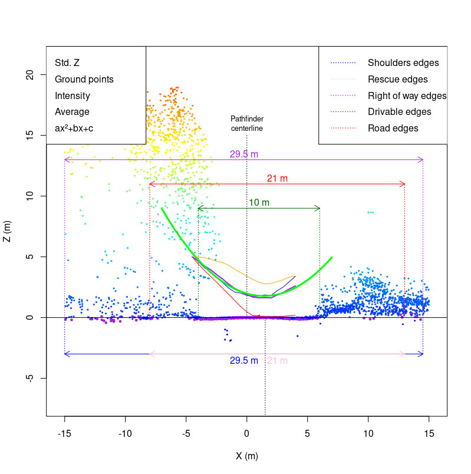
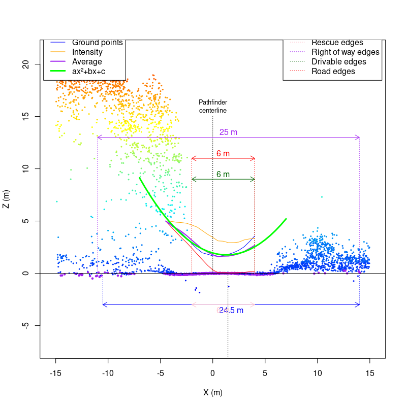
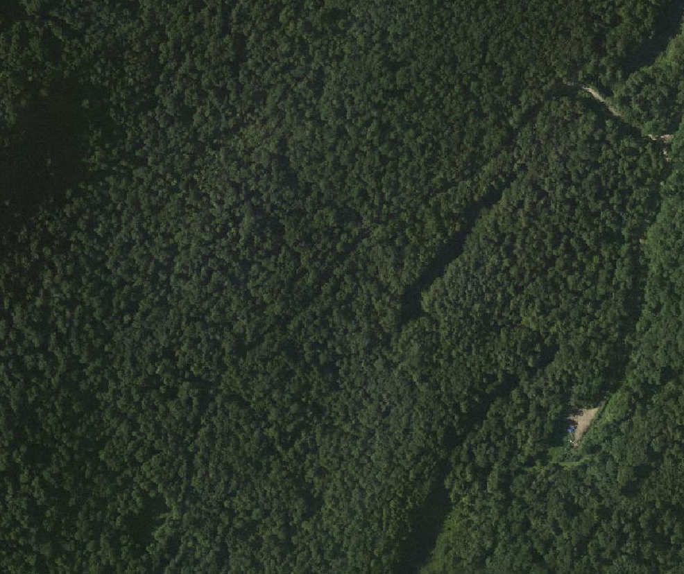
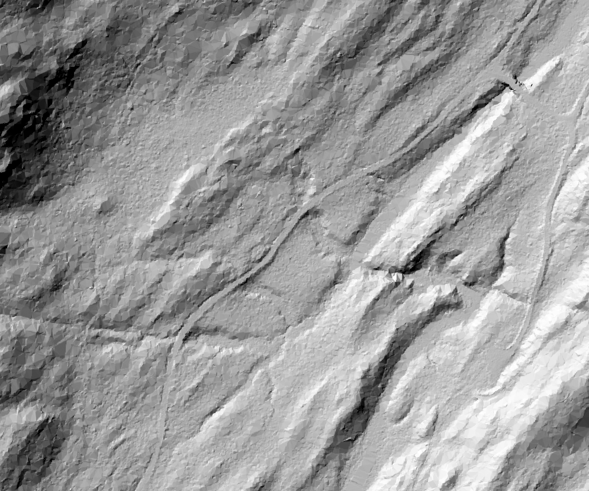
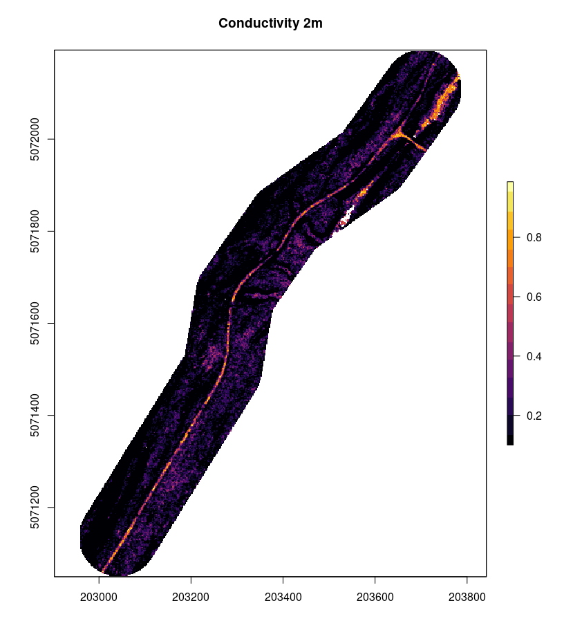

```{r,echo=FALSE,message=FALSE,warning=FALSE}
library(lidR)
library(ggplot2)
library(raster)
library(sf)
library(ALSroads)

r3dDefaults = rgl::r3dDefaults
m = structure(c(0.921, -0.146, 0.362, 0, 0.386, 0.482, -0.787, 0, 
-0.06, 0.864, 0.5, 0, 0, 0, 0, 1), .Dim = c(4L, 4L))
r3dDefaults$FOV = 50
r3dDefaults$userMatrix = m
r3dDefaults$zoom = 0.75

knitr::opts_chunk$set(
  comment =  "#>", 
  collapse = TRUE,
  fig.align = "center")

rgl::setupKnitr(autoprint = TRUE)
knitr::opts_chunk$set(echo = TRUE)

#Case study 1: Low DTM Complexity
dtm_cs1 <- raster("data/06/01/DTM.tif")
rds_cs1 <- st_read("data/06/01/roads.shp")
upd_rds_cs1 <- st_read("data/06/01/upd_roads.shp")

#Case study 2: Road Detection over Water
dtm_cs2 <- raster("data/06/02/DTM.tif")
road_cs2 <- st_read("data/06/02/road.shp")
updated_road_cs2 <- st_read("data/06/02/updated_road.shp")

#Case study 3: Narrow Road Detection
road_cs3 <- st_read("data/06/03/road_upd.shp")

#Case study 4: Detecting a Road Covered by Deciduous Trees
road_cs4 <- st_read("data/06/04/upd_kenauk729196.shp")
```

# Case Studies {#sec-case-studies}

In this section, we present four example applications of the `measure_road()` function. These case studies are located in different forests where road conditions and landscape characteristics are unique. We provide examples where the `measure_road()` standard parameters (see section \@ref(sec-standard-parameters)) are effective and examples where these parameters may require tuning.

-   **Case Study 1: Low DTM Complexity**
-   **Case Study 2: Road Detection over Water**
-   **Case Study 3: Narrow Road Detection**
-   **Case Study 4: Detecting a Road Covered by Deciduous Trees**

## Case Study Structure:

For each case study, we include code snippets outlining how to:

1.  Read the required input data (refer to section \@ref(sec-reading-generating-and-plotting-input-data) for detailed information).
2.  Check the Coordinate Reference System (CRS) of the input data and clip the existing road network to the spatial extent of the LAS catalog.
3.  Update the existing road network using the `measure_roads()` function from the `ALSroads` package.
4.  Adjust the standard road extraction parameters to improve method accuracy (see section \@ref(sec-standard-parameters) for information on the standard parameters).
5.  Visualize road extraction results.

Each case study is 'stand-alone', and users do not need to refer to other sections of the user guide. As such, some code snippets, such as loading data, are repeated for each case study.

## Case Study 1: Low DTM Complexity {#sec-case-study-low-dtm-complexity}

### Overview:

The road extraction method developed by [Roussel et al. (2022)](https://www.sciencedirect.com/science/article/pii/S1569843222002084#d1e1483) uses the geometry of the terrain to relocate and measure the roads correctly. Under ideal circumstances, a road is expected to be flat with steep slopes on its edges (shoulders or embankments). The road is embedded within an environment and surrounded by complex and non-flat topography.

Under these assumptions, a road is not that hard to find and measure. However, problems arise when there is no geometry to detect. This may happen, for example, if the roads are not shaped with ditches on their sides. In this case, the algorithm is supposed to work with a "rescue method" (see section \@ref(sec-terrain-parameters)) that does not use the shoulders but instead the terrain complexity.

Ultimately, if the terrain is perfectly flat, there are no geometrical features that can be used to detect the road. In the following example, we present a method for adjusting the `measure_roads()` standard parameters to detect roads in a landscape where the topography is almost perfectly flat, roads are not nicely shaped, and standard road extraction is challenging.

As the 3D plot of the ground points demonstrates here, the road is easily identifiable, but no geometrical feature can be used to measure it. The road is flat in a flat environment.

```{r, disp = FALSE}
las <-  readLAS("data/06/01/road_10462.las")
plot(filter_ground(las), bg = "white")
```

The road extraction method computes a conductivity layer from the point cloud to estimate how easy/difficult it is for an agent to move between two adjacent pixels. Let's look at the conductivity layer of the road in this case study:

```{r sigplot, warning = FALSE, fig.align='center', fig.width=8, fig.height=6}
sig <- ALSroads::rasterize_conductivity(las, dtm_cs1)
plot(sig, col = viridis::inferno(50))
```

As we can see, the conductivity map is perfect. Geometrical features (shoulders or embankments) are not that important to locate the road. Many other features are used, including vegetation and the local density of points. Thus the road centerline will be perfectly relocated even if the road is flat in a flat environment.

The measurement of the road width is likely to fail because of the absence of clear geometry (shoulders or embankments). Below we can see a slice of the point cloud perpendicularly to the road. For a better understanding of the figure, users should refer to section \@ref(sec-standard-parameters). The key focus of this figure is the red and green arrows that represent the total road width and the drivable width, respectively. The algorithm has determined the road to be 21 m wide, which is clearly incorrect in this case study. The algorithm overestimates the road width in this case study because the landscape surrounding the road is perfectly flat, and there is nothing to constrain the road width.



By altering the default `measure_roads()` parameter to be more aggressive and less tolerant to various sources of noise, we can relocate the road more accurately.



In this specific slice, 6 m is probably a minor underestimation of the actual road width. Users must remember that measurements are performed on numerous consecutive slices and averaged (see section \@ref(sec-extraction-parameters) for information on road slices). For this specific road, the default parameters result in the road being classified as a 13.6 m wide (total width) 'Class 2' road. Once the parameters are adjusted, the road is classified as a 7.6 m (total width) 'Class 1' road. The custom parameters result in a road width and road Class more representative of the actual road.

If the method classifies the road width as 13.6 m, many points will be found above the road (i.e., vegetation). This interpretation impacts the road classification (see section \@ref(sec-state-parameters)) as the method assesses the road as having vegetation on it, which would limit road drivability. However, suppose the actual road width is only 7.6 m. In that case, the algorithm will not find vegetation on the road, as this vegetation is beyond the road edge boundaries, and the road will be determined to be a very clean 'Class 1' road.

Tuning the \`measure_roads()\` parameters on a road-by-road basis is impossible and unsuitable for updating extensive forest road networks. Doing so would defeat the method's purpose, which is automatically updating road networks. Instead of tuning parameters to suit individual roads, users should tune parameters by landscape.

In this case study, the custom parameters work well, but the default parameters are generally preferable. It is important to remember that this is an **edge case** and represents an extreme scenario.

### Data, Method, and Application: {#sec-method-and-application}

The following sections present example code and method implementation for adjusting `measure_roads()` parameters in a low DTM complexity case study.

#### Required R Packages: {#sec-required-r-packages}

``` r
remotes::install_github("Jean-Romain/ALSroads") #Install the ALSroads Package

library("ALSroads") 
library("lidR")
library("raster")
library("sf")
library("ggplot2")
```

#### Loading Data: {#sec-loading-data}

``` r
ctg <- readLAScatalog"path/to/ctg/files", filter = "-drop_withheld-keep_random_fraction 0.25")
dtm <- raster("path/to/dtm.tif")
roads <- st_read("path/to/roads")

st_crs(roads) = st_crs(ctg)
roads = sf::st_crop(roads, ctg)
```

#### Road Extraction  and Parameter Tuning: {#sec-parameter-tuning}

The `measure_roads()` **terrain parameters** dictate how the method handles DTM complexity (see section \@ref(sec-terrain-parameters)). The standard terrain parameters are:

1.  max_elevation_ground_points: `Default = 0.1`
2.  max_sd_ground_points: `Default = 0.15`

In a low DTM complexity area, decreasing the `max_elevation_ground_points` and `max_sd_ground_points` improves the accuracy of road extraction. **In this case study, we decrease the `max_elevation_ground_points` to 0.07 and the `max_sd_ground_points` to 0.04.**

``` r
custom_param = alsroads_default_parameters
custom_param$terrain$max_elevation_ground_points = 0.07
custom_param$terrain$max_sd_ground_points = 0.04

updated_roads_custom_param <- measure_roads(ctg = ctg, roads = roads, dtm = dtm, param = custom_param)
```

### Results {#sec-results}

Plotting the updated road network alongside the existing road network allows the visualization of the updated roads.

```{r, echo = FALSE, fig.width = 7.1, fig.height = 7}
poly = mapply(function(x,y)
{
  x = st_geometry(x)
  if (!is.na(y)) 
    x = st_buffer(x, dist = y) 
  else 
    x = st_buffer(x, dist = 0.1)
  return(st_sf(st_sfc(x)))
}, 
st_geometry(upd_rds_cs1), 
upd_rds_cs1$ROADWID)
poly = do.call(c, poly)
st_crs(poly) = st_crs(upd_rds_cs1)

plot(dtm_cs1, col = gray((0:25)/25))
plot(st_geometry(rds_cs1), add = T)
col = c("lightgray", "darkgreen", "orange", "red", "black")[upd_rds_cs1$CLASS+1]
plot(poly, add = T, col = col, border = col, lwd = 2)
```

## Case Study 2: Road Detection over Water

### Overview

In this case study, we use the `measure_roads()` function to update a road crossing the Mattagami River (rivière Mattagami) in the Romeo Malette Forest, Ontario. The figure below visualizes the LAS tile used in this example and shows the river on the landscape.

``` r
las_c <- clip_circle(las, 466200, 5363600, 400)
x <- plot(las_c, bg = "white", size = 3)
add_dtm3d(x, dtm)
```


By plotting the road which crosses the Mattagami River on a base map, using the `mapView()` function, we can see that part of this road is a bridge. For more information on interactive plotting with `mapView(),` refer to section \@ref(sec-interactive-spatial-plotting).

```{r plot-waterbodies_cs1, message=FALSE, warning = FALSE, fig.align='center', fig.width=8, fig.height=6, echo = FALSE}
url <- "https://servicesmatriciels.mern.gouv.qc.ca:443/erdas-iws/ogc/wmts/Inventaire_Ecoforestier/Inventaire_Ecoforestier/default/GoogleMapsCompatibleExt2:epsg:3/{z}/{y}/{x}.jpg"

m <- mapview::mapview(list(road_cs2),
                      layer.name = c("Waferboard_Road"),
                      col.regions=list("red"),
                      map.type = "Esri.WorldImagery")
leaflet::addTiles(m@map, url)
```

### Data, Method, and Application

The following sections present example code and method implementation for applying the `measure_roads()` function to update an existing road that crosses a waterbody. In this case, a bridge crosses the waterbody. If there was no bridge, the method would interpret the waterbody as an impassable obstacle. The `measure_roads()` standard parameters (see section \@ref(sec-standard-parameters)) are sufficient for updating roads that cross bridges.

#### Required R Packages:

``` r
remotes::install_github("Jean-Romain/ALSroads") #Install the ALSroads Package

library("ALSroads") 
library("lidR")
library("raster")
library("sf")
library("ggplot2")
```

#### Loading Data:

``` r
ctg <- readLAScatalog"path/to/ctg/files", filter = "-drop_withheld-keep_random_fraction 0.25")
dtm <- raster("path/to/dtm.tif")
roads <- st_read("path/to/roads")

st_crs(roads) = st_crs(ctg)
roads = sf::st_crop(roads, ctg)
```

#### Road Extraction:

``` r
updated_road <- measure_roads(ctg = ctg, roads = road, dtm = dtm)
```

### Results

The ability of the `meaure_roads()` function to update a road that crosses a waterbody and interpret the bridge as part of the road is important for producing a fully connected road network. In this example, the width of the bridge means that there are many points located on it. The algorithm is able to interpret the bridge as a road of Class 1, with an average drivable width of 9.1 m.

```{r plot-rd, warning = FALSE, fig.align='center', fig.width=8, fig.height=6}
plot(dtm_cs2)
plot(updated_road_cs2[1], add = TRUE)
```

## Case Study 3: Detecting Narrow Roads

### Overview

The road extraction method developed by [Roussel et al. (2022)](https://www.sciencedirect.com/science/article/pii/S1569843222002084#d1e1483) is suitable for locating narrow roads. The method locates roads using several road characteristics, including DTM complexity, embankments, and vegetation. Provided that these characteristics are distinct enough to locate the road centerline, the width of the road will not impact the ability of the algorithm to find the road. However, the method parameters do specify that the road width must be over 1 m. A road with a width of less than 1 m is unlikely to be a road that is drivable by standard vehicles. The figure below visualizes a narrow road of 0.8 m in width, which is impacted by vegetation and is not drivable.


In this case study, we demonstrate the effectiveness of the `measure_roads()` function for relocating a narrow road with a drivable road width of 1.2 m. Users can adjust the standard parameters to specify the minimum road width and road buffer (see section \@ref(sec-extraction-parameters) and \@ref(sec-state-parameters). For example, if a user applies the method in an area where roads must be over 2 m (for a specific vehicle), they can set the minimum road width to 2 m. Or, if users know that in their study area, road centerline inaccuracies are very minimal, they can adjust the road buffer zone to find the correct road centerline within a short distance of the existing centerline, as the figure below visualizes.


We update a road in the Dog River-Matawin Forest in Ontario. We do not change the standard parameters in this case study, as they are sufficient for updating narrow roads. The road is narrow and in a generally flat area but can be detected, as the DTM below demonstrates.


### Data, Method, and Application

The following sections present example code and method implementation applying the `measure_roads()` function to update a narrow road using standard parameters.

#### Required R Packages:

``` r
remotes::install_github("Jean-Romain/ALSroads") #Install the ALSroads Package

library("ALSroads") 
library("lidR")
library("raster")
library("sf")
library("ggplot2")
```

#### Loading Data:

``` r
ctg <- readLAScatalog"path/to/ctg/files", filter = "-drop_withheld-keep_random_fraction 0.25")
dtm <- raster("path/to/dtm.tif")
roads <- st_read("path/to/roads")

st_crs(roads) = st_crs(ctg)
roads = sf::st_crop(roads, ctg)
```

#### Road Extraction:

The standard `measure_roads()` parameters are sufficient for updating a narrow road.

``` r
updated_roads_custom_param <- measure_roads(ctg = ctg, roads = roads, dtm = dtm, param = custom_param)
```

### Results

The updated road is relocated accurately, and the new road linestring includes information about the state and width of the road, as well as the road curvature, shoulders, and canopy cover. From the results, we can plot the road width and visualize the footprint of the road on the landscape.

```{r, message=FALSE, warning = FALSE, fig.align='center', fig.width=8, fig.height=6, echo = FALSE}
road_poly <- sf::st_buffer(road_cs3, road_cs3$ROADWID/2)

url <- "https://servicesmatriciels.mern.gouv.qc.ca:443/erdas-iws/ogc/wmts/Inventaire_Ecoforestier/Inventaire_Ecoforestier/default/GoogleMapsCompatibleExt2:epsg:3/{z}/{y}/{x}.jpg"
m <- mapview::mapview(list(road_cs3, road_poly),
                      layer.name = c("Corrected Road", "Road Width Buffer"),
                      col.regions=list("blue","orange"),col=list("blue","orange"),
                      map.type = "Esri.WorldImagery")
leaflet::addTiles(m@map, url)
```

## Case study 4: Detecting a Road Covered by Deciduous Trees

### Overview

In the following example, the road is barely invisible from above because it is completely covered by deciduous trees. Using RGB images or using a CHM, it is impossible to find and measure the road.

{width="70%"}

The `ALSroads` uses multiple inputs to locate roads (i.e., DTM, CHM, density of ground points, etc.) and does not rely exclusively on the CHM to find the road. Therefore, even a road totally covered by deciduous trees can be located. In this specific case study, the road is visible in the DTM. It is also visible in the density of ground points.

{width="70%"}

Overall, the road is visible in LiDAR data, even if some indicators, such as the CHM, cannot be used independently to locate the road. Therefore, this edge case works 'out-of-the-box' and the conductivity layer effectively highlights the road on the landscape, despite the road being covered by deciduous trees.

{width="70%"}

Using the `measure_road()` function the road is properly located and measured 'out-of-the-box' with standard parameters (see section \@ref(sec-standard-parameters). The road is particularly well-shaped and measuring its width (total and drivable) is not a problem. Here, the algorithm measured an 8.6 m 'Class 1' road. In the image below, we can see in purple the original inaccurate track of the official map and in yellow the new track with additional attributes.

{width="70%"}

### Data, Method, and Application

The following sections present example code and method implementation applying the `measure_roads()` function to update a road covered by deciduous trees.

#### Required R Packages:

``` r
remotes::install_github("Jean-Romain/ALSroads") #Install the ALSroads Package

library("ALSroads") 
library("lidR")
library("raster")
library("sf")
library("ggplot2")
```

#### Loading Data:

``` r
ctg <- readLAScatalog"path/to/ctg/files", filter = "-drop_withheld-keep_random_fraction 0.25")
dtm <- raster("path/to/dtm.tif")
roads <- st_read("path/to/roads")

st_crs(roads) = st_crs(ctg)
roads = sf::st_crop(roads, ctg)
```

#### Road Extraction:

The standard `measure_roads()` parameters are sufficient for updating the road in the case study.

``` r
updated_roads_custom_param <- measure_roads(ctg = ctg, roads = roads, dtm = dtm, param = custom_param)
```

### Results:

Despite being covered by deciduous trees the updated road is relocated accurately and includes information on the road width. From the results, we can plot the road and visualize the footprint of the road on the dense deciduous forest landscape.

```{r, message=FALSE, warning = FALSE, fig.align='center', fig.width=8, fig.height=6, echo = FALSE}

url = "https://servicesmatriciels.mern.gouv.qc.ca:443/erdas-iws/ogc/wmts/Inventaire_Ecoforestier/Inventaire_Ecoforestier/default/GoogleMapsCompatibleExt2:epsg:3857/{z}/{y}/{x}.jpg"
m <- mapview::mapview(list(road_cs4),
                      layer.name = c("Corrected Road"),
                      col.regions=list("blue"),col=list("blue"),
                      map.type = "Esri.WorldImagery")
leaflet::addTiles(m@map, url)
```
