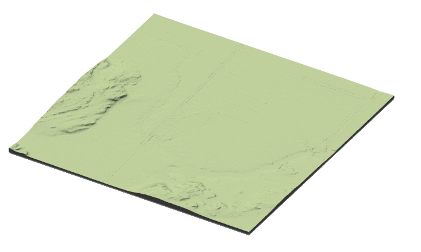

```{r,echo=FALSE,message=FALSE,warning=FALSE}
library(lidR)
library(ggplot2)
library(raster)
library(sf)
library(forcats)
library(ALSroads)

r3dDefaults = rgl::r3dDefaults
m = structure(c(0.921, -0.146, 0.362, 0, 0.386, 0.482, -0.787, 0, 
-0.06, 0.864, 0.5, 0, 0, 0, 0, 1), .Dim = c(4L, 4L))
r3dDefaults$FOV = 50
r3dDefaults$userMatrix = m
r3dDefaults$zoom = 0.75

knitr::opts_chunk$set(
  comment =  "#>", 
  collapse = TRUE,
  fig.align = "center", 
  fig.pos = "H", 
  out.extra = "")

rgl::setupKnitr(autoprint = TRUE)

#Data
existing_roads <- st_read("data/07/roads.shp")
updated_roads <-st_read("data/07/updated_roads.shp")
updated_roads$CLASS <- as.factor(updated_roads$CLASS)
updated_roads_ <- updated_roads %>%
  dplyr::filter(NUM %in% c(4,6,16))
snapped_roads <- st_snap_lines(roads = updated_roads_, tolerance = 200)
existing_road <- existing_roads %>%
  dplyr::filter(NUM %in% c(23))
updated_road <- updated_roads %>%
  dplyr::filter(NUM %in% c(23))
```

# Tips and Tricks {#sec-tips-and-tricks}

Following the update of road segments using the `ALSroads` package, users may wish to edit data, filter results, or plot outcomes. Here, we include code snippets to provide users with basic data manipulation and interpretation tools.

In the following sections, users are recommended to refer to the package manuals for additional information. When using functions in R users can type `?function_name()` into the R console to find information about the input data requireed, and example applications or that function. For example, running `?measure_roads()` in the console will bring up information about the function.

## Casting Roads to Linestring {#sec-casting-roads-to-linestring}

Existing road networks may be multistring features; the `measure_roads()` function requires that roads are linestrings. Changing multistring features to linestrings requires the `st_cast()` function from the `sf` package (refer to the [sf vignette](https://cran.r-project.org/web/packages/sf/sf.pdf) for detailed information).

``` r
library("sf")
roads <- st_cast(roads, "LINESTRING")
```

## Adding an ID Column {#sec-adding-an-id-column}

Existing road networks frequently include FID and ID columns that help users select individual roads. In some cases, however, road networks have been edited or updated, and the ID/FID columns are missing information.

Users may wish to add a new ID column that relates explicitly to the roads on which the `ALSroads` method is applied. In that case, users can add and populate a new column using the `rowid_to_column` function from the `tibble` package (refer to the [tibble vignette](https://cloud.r-project.org/web/packages/tibble/tibble.pdf) for detailed information).

``` r
library("tribble")
roads <- tibble::rowid_to_column(roads, "NEW_ID")
```

## Selecting Specific Roads {#sec-selecting-specific-roads}

Users may wish to update only selected roads from the existing road network, not the entire network. Users can select specific roads using the `filter` function from the `dplyr` package (refer to the [dplyr vignette](https://cran.r-project.org/web/packages/dplyr/vignettes/dplyr.html) for detailed information).

Users can select roads using an ID column where row values are unique. In this case, we use the "NEW_ID" column (see section \@ref(sec-adding-an-id-column)).

Users can select a single road:

``` r
library("dplyr")
road_subset <- roads %>%
  dplyr::filter(NEW_ID %in% c(10))
```

Multiple roads:

``` r
library("dplyr")
road_subset <- roads %>%
  dplyr::filter(NEW_ID %in% c(5,10,15))
```

Or, a series of roads (all roads between 10 and 50 will be selected):

``` r
library("dplyr")
road_subset <- roads %>%
  dplyr::filter(NEW_ID %in% c(10:50))
```

## Plotting Data {#sec-plotting-data}

### Interactive Spatial Plotting with `mapView()`: {#sec-interactive-spatial-plotting}

Users working within R can produce interactive spatial plots using the function `mapView()` from the package `mapview`(refer to the [mapview vignette](https://rdrr.io/github/r-spatial/mapview/man/)). The `mapView()` function produces an interactive view of spatial object(s) on top of a base map.

```{r plot-leflet-example, warning = FALSE, fig.align='center', fig.width=8, fig.height=6}
library("mapview")
library("leaflet")

url = "https://servicesmatriciels.mern.gouv.qc.ca:443/erdas-iws/ogc/wmts/Inventaire_Ecoforestier/Inventaire_Ecoforestier/default/GoogleMapsCompatibleExt2:epsg:3/{z}/{y}/{x}.jpg"

m <- mapview::mapview(list(existing_road, updated_road),
  layer.name = c("Existing", "Updated"),
  color = c("red", "blue"), map.type = "Esri.WorldImagery")
leaflet::addTiles(m@map, url)
```

### Spatial Plotting with `plot()`: {#sec-spatial-plotting-with-plot}

For generic plotting, users can use the `plot()` function, which is included in base R.

```{r plot-base-example, warning = FALSE, fig.align='center', fig.width=6, fig.height=4}
plot(updated_road[1]) #[1] specifies that only the first attribute will plot
```

### Plotting with `ggplot()`: {#sec-plotting-with-ggplot}

`ggplot2` is a plotting package that supports the creation of complex plots. `ggplot2` is commonly used, in R, to produce publication-quality plots. For detailed information on using `ggplot2`, we recommend users refer to the [ggplot2 website](https://ggplot2.tidyverse.org/). See section \@ref(sec-attribute-plotting-updated-roads) for more examples of plotting road attributes using `ggplot2`.

```{r plot-ggplot-example, warning = FALSE, fig.align='center', fig.width=6, fig.height=4}
library("ggplot2")
ggplot(data=updated_roads, aes(x=CLASS, y= SCORE, fill=CLASS)) +
    geom_boxplot(size = 0.25, color="black", coef = 1, outlier.size = 0.5)+
    labs(y = "Road Score", x = "Road class")+
      theme(text = element_text(size = 16))
```

### Plotting LiDAR data: {#sec-plotting-lidar-data}

The `lidR` package takes advantage of the `rgl` package to provide an interactive 3D viewer with points coloured by Z coordinates. The `lidR` package provides several functions for plotting LiDAR data, that include: overlay plotting and tree-top plotting. We strongly recommend that users interested in plotting LiDAR data refer to the [lidR book](https://r-lidar.github.io/lidRbook/io.html#plot).

``` r
library("lidR")
plot(las)
```


### 3D Plotting Raster Data: {#sec-3d-plotting-raster-data}

**`rayshader`** is an open source package for producing 2D and 3D data visualizations in R. `rayshader` uses elevation data in a base R matrix and a combination of raytracing, hillshading algorithms, and overlays to generate 2D and 3D maps (refer to the [rayshader website](https://www.rayshader.com/) for more information).

``` r
library(rayshader)
elmat <- raster_to_matrix(dtm)
map <- elmat %>%
  sphere_shade(texture = "imhof1", progbar = FALSE) %>%
  add_water(detect_water(elmat), color = "imhof1") %>%
  add_shadow(ray_shade(elmat, progbar = FALSE), 0.5) %>%
  add_shadow(ambient_shade(elmat, progbar = FALSE), 0)
plot_3d(map, elmat, zscale = 20, windowsize = c(800, 800))
```



## Saving Data {#sec-saving-data}

Following the extraction of roads from an ALS point cloud and the update of the existing road network, users will need to save the new network as a file that can be opened in R and other GIS programs, such as ArcGIS.

To save simple features (lines and polygons), users can use the 'st_write' function from the 'sf' package (refer to the [sf vignette](https://cran.r-project.org/web/packages/sf/vignettes/sf1.html) for detailed information).

``` r
library("sf")
st_write(road_subset, "path/to/folder/roads_subset.shp")
```

If users have produced raster data files while working with `ALSroads`, for example a DTM. In that case, this data can be saved using the `writeRaster` function from the `raster` package (refer to the [raster manual](https://cran.r-project.org/web/packages/raster/raster.pdf) for detailed information).

``` r
library("raster")
writeRaster(DTM, "path/to/folder/DTM.tif", format = "GTiff")
```

## Reconnecting Roads {#sec-reconnecing-roads}

The updated road network will include all of the roads in the existing road network. However, because the method relocates each road, the updated network may appear disconnected, with road ends no longer perfectly aligning. The `st_snap_lines()` function was added to the `ALSroads` package to address this and ensure that the updated road network is topologically valid.

This post-processing step involves the "snapping" of road ends together, with or without prior knowledge of road connections. If users provide the existing road network to the `st_snap_lines()`, the connection of roads will be more accurate. Users can also specify tolerance (distance) between two roads where snapping will occur.

``` r
library("ALSroads")
snapped_roads <- st_snap_lines(roads = updated_roads, ref = existing_roads, field = "NEW_ID", tolerance = 30)
```

```{r plot-snap, warning = FALSE, fig.align='center', fig.width=8, fig.height=6}
library("mapview")
library("leaflet")
url <- "https://servicesmatriciels.mern.gouv.qc.ca:443/erdas-iws/ogc/wmts/Inventaire_Ecoforestier/Inventaire_Ecoforestier/default/GoogleMapsCompatibleExt2:epsg:3/{z}/{y}/{x}.jpg"

m <- mapview::mapview(list(updated_roads_, snapped_roads$roads),
                      layer.name = c("Snapped", "Updated"),
                      color = c("green", "red"),
                      lwd = c(3, 1.5),
                      map.type = "Esri.WorldImagery") 
leaflet::addTiles(m@map, url)
```

Other post-processing functions included in the `ALSroads` package are:

-   `check_road_differences`: Check the amplitude of differences between corrected and uncorrected roads.

-   `st_check_crossings`: Check if roads cross at points other than at their ends.

-   `st_check_junctions`: Check if road endings are close enough to be considered potential junctions.

## RStudio Shortcuts {#sec-rrtudio_shortcuts}

-   `ctrl+shift+C`: Comment lines in and out.

-   `alt + -`: Shortcut for `<-` .

-   `ctrl-1` and `crtl-2`: Shift the cursor focus to script or console, respectively.

-   `ctrl-shift-d`: Duplicate the current line or selected text.

-   `ctrl-shift-arrow`: Highlight chunks of text.

-   `ctrl-D`: Delete Line.

-   `alt+shift+K`: View and edit keyboard shortcuts.
