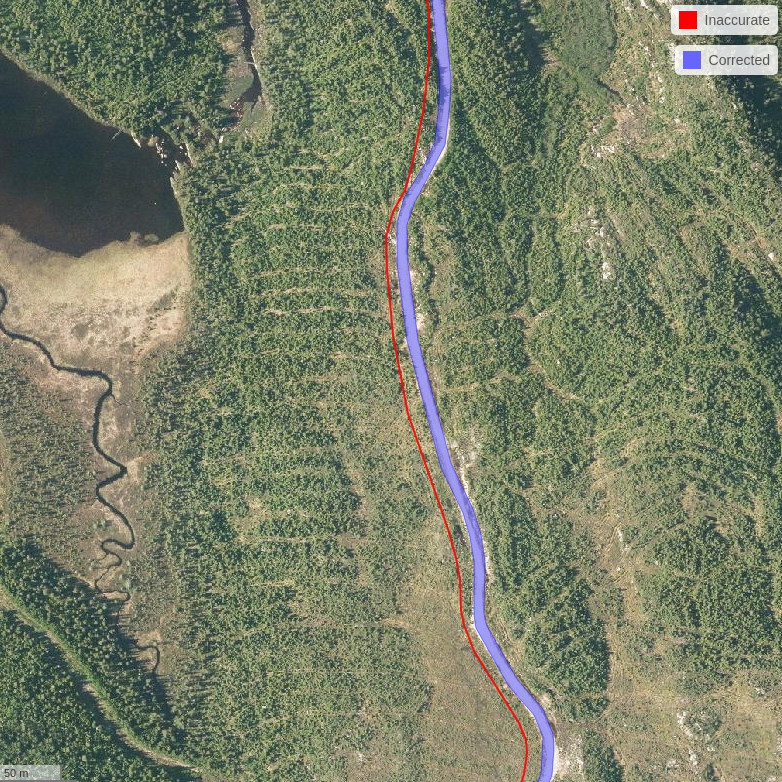

# Introduction {#sec-introduction}

`ALSroads` is an R package for correcting, updating, and enhancing vectorial forest road maps using airborne laser scanning (ALS) data. Using a reference map and an ALS point clouds the method -- which is described in [Roussel et al. (2022)](https://www.sciencedirect.com/science/article/pii/S1569843222002084#d1e1483) -- relocates existing roads to their correct path, measures the width of roads, and assigns a class to each road segment.

In the following figure, the red line is the existing road segment recorded and maintained by an authority. This road segment is not associated with any information about the road state, and the road path is inaccurate. The [Roussel et al. (2022)](https://www.sciencedirect.com/science/article/pii/S1569843222002084#d1e1483) method uses the existing road segment as prior information to relocate the road path and derive information about the characteristics of the road. In the example below, the algorithm updated the path of the existing road segment and determined that it is a Class 1 (good state) road with a width of 9 m.

The `ALSroads` package is open source and integrated within the geospatial R ecosystem (i.e., `raster` and `sf`). The package utilizes the `lidR` package, developed for manipulating and visualizing Airborne LiDAR Scanning (ALS) data. This user guide has been written to support users with varying experience working with LiDAR data.

Development of the `ALSroads` package was made possible by the financial support of the [Ministère des Forêts, de la Faune et des Parcs du Québec, Canada (MFFP)](https://mffp.gouv.qc.ca/).

Testing of the `ALSroads` package in Ontario was made possible by the [Forestry Futures Trust Ontario](http://www.forestryfutures.ca/) (Project number: KTTD 2B-2021) and an NSERC Discovery grant (RGPIN-2018-03851), grantee [Prof. Nicholas C. Coops](https://forestry.ubc.ca/faculty-profile/nicholas-coops/).

------------------------------------------------------------------------

